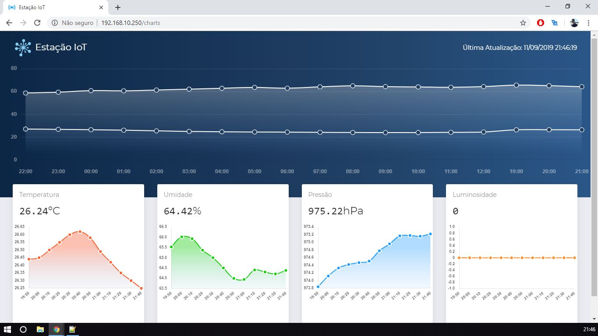

# Estação meteorológica

Neste projeto, um dispositivo **ESP8266**, conetado na rede Wifi, envia por meio do **protocolo MQTT** os dados de:
 - Temperatura
 - Umidade do Ar
 - Pressão Atmosférica
 - Luminosidade

Que são coletados dos sensores acoplados ao dispositivo:
 - TEMT6000
 - BME280

As informações coletadas são publicadas para o **Broker MQTT *Mosquitto*** as reencaminhem.
 
O Broker reencaminha as mensagens para um **servidor Node.js** que está programado para recebe-las e armazená-las no bando de dados. 
Este servidor também é responsável por prover uma pagina web onde são exibidos gráficos das informações coletadas.
 
Esta página web é atualizada automaticamente, toda vez que o servidor recebe uma mensagem do dispositivo, por meio da **comunicação Socket**. 
Os três serviços, banco de dados, servidor e Broker, estão rodando destro de containers, atualmente, dentro de um Raspberry PI 3.
 

 - Segue algumas imagens do Website:

- ESP8266 imagem:

